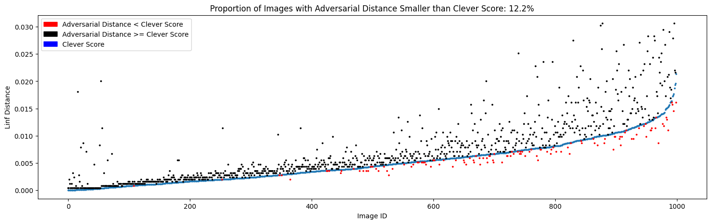

# Structured Comparison of Metrics to Evaluate the Robustness of Image Classification Models

## Abstract
This research evaluates the robustness of image classification models against adversarial attacks using two metrics: Adversarial Distance and CLEVER. The study uses variants of the WideResNet model trained on the CIFAR-10 dataset, including a standard and a corruption-trained robust model. Key findings include:

- __Adversarial Distance Metric__: Provides an upper-bound approximation of perturbations.
- __CLEVER Metric__: Offers a lower-bound estimation of perturbations.
The corruption-trained robust model exhibits greater resilience against adversarial examples compared to the standard model.

## Introduction
Advancements in deep learning have highlighted vulnerabilities in image classifiers to adversarial attacks. This project focuses on a systematic comparison of robustness metrics using the WideResNet architecture.

## Methodology
- __Dataset__: CIFAR-10
- __Models__: Standard WideResNet and corruption-trained WideResNet
- __Metrics__: Adversarial Distance (L∞ norm) and CLEVER score
- __Tools__: PyTorch and CleverHans library for implementing attacks and measuring robustness.

## Results

